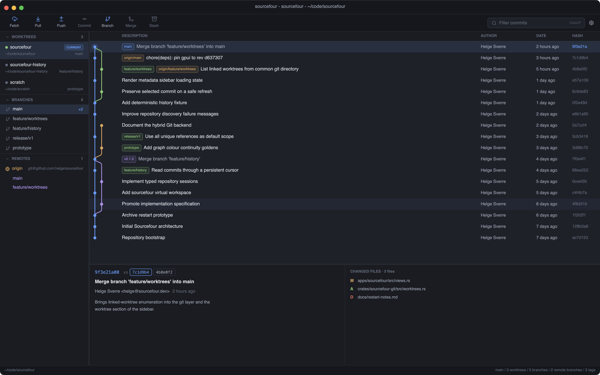

# Sourcefour

A fast, native Git history browser you launch from your terminal. Press one
command inside a repository and get the useful half of SourceTree: the commit
graph, refs, commit details, and diffs — nothing to configure, nothing to log
into.

Built with [GPUI](https://www.gpui.rs) for GPU-rendered native UI and
[gitoxide](https://github.com/GitoxideLabs/gitoxide) for reading repositories.



## Install

| Platform | Installer | Package manager |
| --- | --- | --- |
| macOS | [`.pkg`](https://github.com/HelgeSverre/sourcefour/releases/latest/download/sourcefour-universal-apple-darwin.pkg), universal, signed and notarized | `brew install --cask helgesverre/tap/sourcefour` |
| Windows | [`.msi`](https://github.com/HelgeSverre/sourcefour/releases/latest/download/sourcefour-x86_64-pc-windows-msvc.msi), 64-bit | — |
| Linux | [`.AppImage`](https://github.com/HelgeSverre/sourcefour/releases/latest/download/sourcefour-x86_64-unknown-linux-gnu.AppImage), x86-64 | `brew install helgesverre/tap/sourcefour` |

Those links always resolve to the newest tagged release; the filenames never
carry a version, which is what keeps them stable. To build from source instead:

```sh
cargo install --git https://github.com/HelgeSverre/sourcefour sourcefour
```

## Use

```sh
sourcefour            # browse the repository containing the working directory
sourcefour ~/code/foo # browse a specific repository
sourcefour --demo     # browse a generated demo repository
```

## Development

Everything runs through [`just`](https://github.com/casey/just); `just --list`
shows the recipes, grouped into run, build, check, and dist.

```sh
just run      # launch the app on the current repository
just test     # cargo nextest across the workspace
just check    # the full pre-push gate — the same one CI runs
just package  # build dist/Sourcefour.app (ad-hoc signed, local use)
```

The website lives in `website/`. Its screenshots — and the one above — are
captures of the deterministic demo fixture, regenerated with `just screenshots`
and never edited by hand, so they cannot claim anything the app does not do.
`--scene` names every view worth capturing; the script ships the subset the
website and this file use.

## Releasing

CI runs format, lint, tests, and locked debug/release builds on every pull
request — Linux only, to keep the bill down, since macOS and Windows minutes
bill at 10x and 2x. The full three-platform matrix runs on demand from the
Actions tab, and **must be run before cutting a release**: nothing else checks
that the macOS and Windows builds still compile, and the release packages all
three.

Releases are cut by [cargo-dist](https://opensource.axo.dev/cargo-dist/).
Pushing a version tag runs the test suite first, and only then builds anything:

```sh
just release 0.2.0
```

| Artifact | Built by | Notes |
| --- | --- | --- |
| Archives, checksums, Homebrew formula | cargo-dist | macOS (both arches), Linux x86-64, Windows x64 |
| Homebrew cask | `.github/workflows/release.yml` | Installs the signed universal `.pkg` and exposes its CLI |
| `.msi` | cargo-dist + `apps/sourcefour/wix/main.wxs` | Start Menu shortcut, optional PATH entry |
| `.pkg` | `.github/workflows/macos-pkg.yml` | Universal, signed, notarized, stapled |
| `.AppImage` | `.github/workflows/linux-appimage.yml` | Built on ubuntu-22.04 for a low glibc floor |

The `.pkg` and the `.AppImage` are maintained alongside the generated jobs
because cargo-dist produces neither. `release.yml` is hand-edited to add the
test gate, those two jobs, and the macOS cask publisher, which is why
`dist-workspace.toml` marks `ci` as allowed-dirty; rerun `dist generate` after
changing dist config and re-apply those edits.

### Secrets this needs

| Name | Kind | What it is |
| --- | --- | --- |
| `HOMEBREW_TAP_TOKEN` | secret | Fine-grained PAT on `HelgeSverre/homebrew-tap`, Contents: read and write |
| `APPLE_APPLICATION_CERTIFICATE_BASE64` / `_PASSWORD` | secret | Developer ID **Application** certificate, base64 `.p12` |
| `APPLE_INSTALLER_CERTIFICATE_BASE64` / `_PASSWORD` | secret | Developer ID **Installer** certificate, base64 `.p12` |
| `APPLE_NOTARY_KEY_BASE64` | secret | App Store Connect API key, base64 `.p8` |
| `APPLE_APPLICATION_SIGNING_IDENTITY`, `APPLE_INSTALLER_SIGNING_IDENTITY` | variable | Certificate common names |
| `APPLE_NOTARY_ISSUER_ID`, `APPLE_NOTARY_KEY_ID`, `APPLE_TEAM_ID` | variable | Notary and team identifiers |

The Homebrew token publishes the formula and cask; the Apple values are what
make the `.pkg` job run. Until they exist, a tag will build everything and then
fail at the `.pkg` step rather than publishing a release with a missing macOS
installer.

## License

[MIT](LICENSE).
